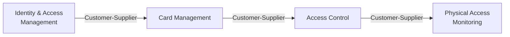

# SICA — Índice de Modelado DDD

> **Fase Bolt**: DISCOVERY (Domain Modeling)
> **Fuente**: Análisis legacy → modelado estratégico y táctico

---

## Resumen ejecutivo

El dominio SICA se ha modelado en **4 bounded contexts core** más **2 de soporte**, con
un total de **9 aggregates**, siguiendo Domain-Driven Design táctico y estratégico.

---

## Context Map

📍 **Documento maestro**: [context-map.md](context-map.md)

---

## Bounded Contexts (core)

### 1. Identity & Access Management (IAM)

| Aspecto          | Fichero                                                |
| ---------------- | ------------------------------------------------------ |
| Lenguaje ubicuo  | [iam/ubiquitous-language.md](iam/ubiquitous-language.md) |
| Modelo de dominio| [iam/domain-model.md](iam/domain-model.md)             |

**Aggregates**:
- `User` (Employee, Visitor) — gestión de identidad
- `Terminal` — autorización de terminales
- `Session` — sesiones autenticadas

**Reglas**: RULE-001, 002, 003, 008, 009

---

### 2. Card Management

| Aspecto          | Fichero                                                              |
| ---------------- | -------------------------------------------------------------------- |
| Lenguaje ubicuo  | [card-management/ubiquitous-language.md](card-management/ubiquitous-language.md) |
| Modelo de dominio| [card-management/domain-model.md](card-management/domain-model.md)   |

**Aggregates**:
- `SmartCard` — tarjetas inteligentes con clasificación por prefijo
- `VisitorCard` — subtipo con disponibilidad y ventana de validez

**Reglas**: RULE-004, 005, 006, 007

---

### 3. Access Control

| Aspecto          | Fichero                                                              |
| ---------------- | -------------------------------------------------------------------- |
| Lenguaje ubicuo  | [access-control/ubiquitous-language.md](access-control/ubiquitous-language.md) |
| Modelo de dominio| [access-control/domain-model.md](access-control/domain-model.md)     |

**Aggregates**:
- `AccessFamily` — grupos de acceso con membresía
- `AccessPolicy` — reglas Terminal ↔ Familia ↔ Circuito
- `Circuit` — puntos de acceso físicos

**Reglas**: RULE-008 (extensión)

---

### 4. Physical Access Monitoring

| Aspecto          | Fichero                                                              |
| ---------------- | -------------------------------------------------------------------- |
| Modelo de dominio| [monitoring/domain-model.md](monitoring/domain-model.md)             |

**Aggregates**:
- `AccessEvent` — registro inmutable de entrada/salida
- `Alarm` — alarmas de seguridad

**Reglas**: (sin reglas formales extraídas — UC-005)

---

## Eventos de integración (cross-context)

| Evento                       | Publicado por    | Consumido por           |
| ---------------------------- | ---------------- | ----------------------- |
| `UserSyncedFromAD`           | Integration      | IAM                     |
| `UserCreated`                | IAM              | Card Management         |
| `SmartCardActivated`         | Card Management  | Access Control          |
| `AccessPolicyChanged`        | Access Control   | Monitoring              |
| `AccessEventRecorded`        | Monitoring       | (externos)              |
| `TerminalAuthorized`         | IAM              | Access Control          |

---

## Mapeo de reglas → aggregates

| Regla    | Aggregate(s)                          |
| -------- | ------------------------------------- |
| RULE-001 | `Employee` (IAM)                      |
| RULE-002 | `User` (IAM)                          |
| RULE-003 | `User` (IAM), Organization (Support)  |
| RULE-004 | `SmartCard` (Card Management)         |
| RULE-005 | `SmartCard` (Card Management)         |
| RULE-006 | `VisitorCard` (Card Management)       |
| RULE-007 | `VisitorCard` (Card Management)       |
| RULE-008 | `Terminal`, `Session` (IAM), `AccessPolicy` (Access Control) |
| RULE-009 | `Session` (IAM)                       |

---

## Cobertura de casos de uso

| UC ID  | Contextos involucrados                         |
| ------ | ---------------------------------------------- |
| UC-001 | IAM, Integration                               |
| UC-002 | Card Management, Integration                   |
| UC-003 | IAM                                            |
| UC-004 | Card Management, Access Control                |
| UC-005 | IAM, Card Management, Access Control, Monitoring |

---

## Próximos pasos (handoff)

| Artefacto DDD         | Consumidor siguiente                                    |
| --------------------- | ------------------------------------------------------- |
| Context Map           | `@Bolt Architect` → C4 diagrams y ADRs                  |
| Aggregates            | `@Bolt Plan` → data-model.md y OpenAPI contracts        |
| Domain Events         | `@Bolt Plan` → AsyncAPI event contracts                 |
| Value Objects         | `@Bolt Plan` → DTOs y validaciones                      |
| Ubiquitous Language   | `@Bolt Gherkin` → términos en escenarios BDD            |

**Siguiente comando recomendado**: `@Bolt Plan` para generar el plan de implementación
técnico a partir de este modelo de dominio.
