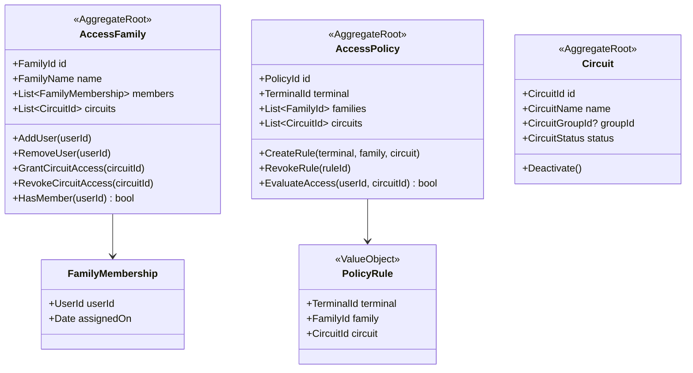

# Access Control — Modelo de Dominio

> **Bounded Context**: Access Control
> **Fase**: DISCOVERY (Domain Modeling)

---

## Aggregates

### 1. AccessFamily Aggregate

**Aggregate Root**: `AccessFamily`

**Responsabilidad**: Gestionar el ciclo de vida de un grupo de acceso, mantener la lista
de usuarios miembros y los circuitos a los que otorga permisos.

**Invariantes**:
- Nombre único en el sistema.
- Debe tener al menos un circuito asociado para ser efectiva.
- No puede tener usuarios duplicados.

**Entidades**:
- `AccessFamily` (root)
- `FamilyMembership` — relación entre familia y usuario

**Value Objects**:
- `FamilyName` — nombre descriptivo
- `FamilyId` — identificador único

**Domain Events**:
- `AccessFamilyCreated`
- `UserAddedToFamily`
- `UserRemovedFromFamily`
- `CircuitAddedToFamily`
- `CircuitRemovedFromFamily`

---

### 2. AccessPolicy Aggregate

**Aggregate Root**: `AccessPolicy`

**Responsabilidad**: Definir y gestionar las reglas de acceso que vinculan terminales,
familias y circuitos.

**Invariantes**:
- Una política vincula exactamente un Terminal, una o más Familias, y uno o más Circuits.
- No puede haber políticas duplicadas (mismo Terminal + Familia + Circuito).

**Value Objects**:
- `PolicyRule` — triple (TerminalId, FamilyId, CircuitId)

**Domain Events**:
- `AccessPolicyCreated`
- `AccessPolicyUpdated`
- `AccessPolicyRevoked`

---

### 3. Circuit Aggregate

**Aggregate Root**: `Circuit`

**Responsabilidad**: Representar un punto de acceso físico (puerta, lector), mantener
su jerarquía (grupo de circuitos) y estado operativo.

**Invariantes**:
- Nombre único.
- Puede pertenecer a un grupo de circuitos (jerarquía).

**Value Objects**:
- `CircuitName` — nombre descriptivo
- `CircuitGroupId` — identificador del grupo (opcional)

**Domain Events**:
- `CircuitRegistered`
- `CircuitDeactivated`

---

## Diagrama de clases (DDD)



---

## Reglas de negocio mapeadas

| Regla    | Aggregate afectado | Método/Invariante                           |
| -------- | ------------------ | ------------------------------------------- |
| RULE-008 | AccessPolicy       | `EvaluateAccess()` — filtrado por terminal  |

---

## Relaciones con otros contextos

| Contexto upstream     | Relación                                    |
| --------------------- | ------------------------------------------- |
| IAM                   | `FamilyMembership.userId` referencia `User` |
| Card Management       | Permisos se evalúan para `SmartCard`        |

| Contexto downstream   | Relación                                    |
| --------------------- | ------------------------------------------- |
| Physical Access Monitoring | Consume políticas para validar accesos |

---

## Domain Services

### PermissionEvaluationService

**Responsabilidad**: Evaluar si un usuario/tarjeta tiene permiso para acceder a un circuito
según las familias a las que pertenece.

**Operación principal**:

```csharp
bool CanAccess(UserId userId, CircuitId circuitId)
{
    // 1. Obtener familias del usuario
    var userFamilies = _familyRepository.GetByUserId(userId);
    
    // 2. Para cada familia, verificar si tiene acceso al circuito
    return userFamilies.Any(family => family.HasCircuitAccess(circuitId));
}
```

---

## Handoff

- → [aggregates.md](aggregates.md): detalle de AccessFamily, AccessPolicy, Circuit
- → [domain-services.md](domain-services.md): PermissionEvaluationService
- → [domain-events.md](domain-events.md): eventos de asignación y revocación
- → `@Bolt Plan`: contracts para API de familias y permisos
