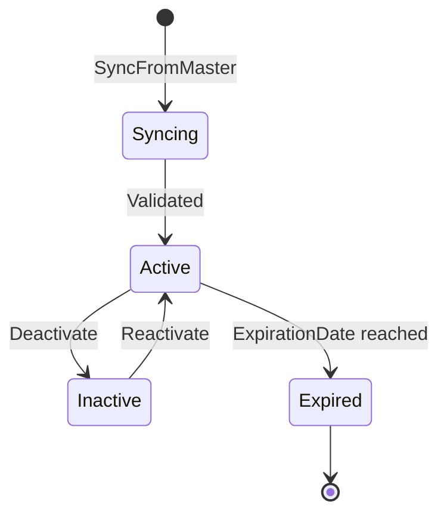
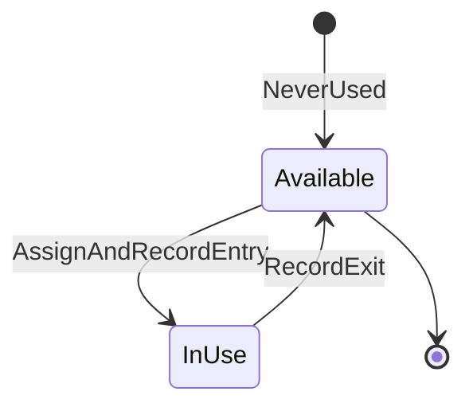
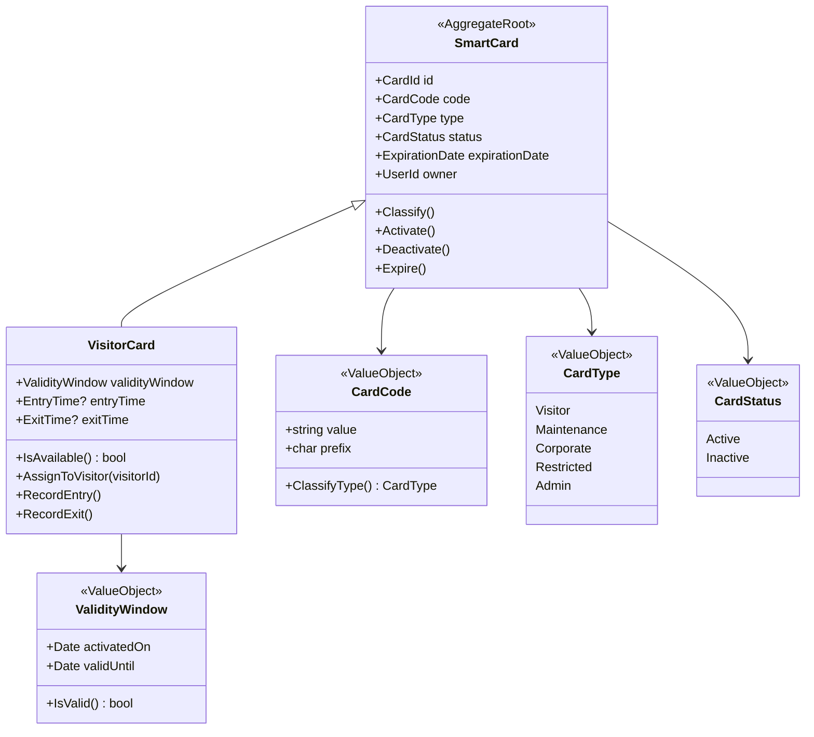

# Card Management — Modelo de Dominio

> **Bounded Context**: Card Management
> **Fase**: DISCOVERY (Domain Modeling)

---

## Aggregates

### 1. SmartCard Aggregate

**Aggregate Root**: `SmartCard`

**Responsabilidad**: Mantener la consistencia del ciclo de vida de una tarjeta inteligente,
garantizar que el tipo deriva del código, y controlar el estado activo/inactivo.

**Invariantes**:
- `CardCode` único en el sistema.
- `CardType` se deriva del prefijo del código (no se asigna manualmente).
- `Owner` (UserId) referencia a un User existente (de IAM).
- Tarjeta inactiva no puede tener `Entry` sin `Exit`.

**Value Objects**:
- `CardCode` — código con prefijo y validación
- `CardType` — enum clasificado por prefijo
- `CardStatus` — Activo / Inactivo
- `ExpirationDate` — fecha de caducidad

**Domain Events**:
- `SmartCardCreated`
- `SmartCardSynced`
- `SmartCardActivated`
- `SmartCardDeactivated`
- `SmartCardExpired`

**Ciclo de vida**:

---

### 2. VisitorCard Aggregate

**Aggregate Root**: `VisitorCard`

**Responsabilidad**: Extender `SmartCard` con lógica específica de visitantes (disponibilidad,
activación temporal, ventana de validez).

**Invariantes**:
- `CardType` debe ser `Visitor`.
- Solo puede estar asignada a un `Visitor` (UserId de tipo Visitor).
- Disponibilidad se determina por `Entry` y `Exit`.

**Value Objects**:
- `ValidityWindow` — período de validez (desde activación)
- `EntryTime` — timestamp de entrada
- `ExitTime` — timestamp de salida

**Domain Events**:
- `VisitorCardActivated`
- `VisitorCardAssigned`
- `VisitorEntryRecorded`
- `VisitorExitRecorded`
- `VisitorCardReturned`

**Máquina de estados (disponibilidad)**:

---

## Diagrama de clases (DDD)

---

## Reglas de negocio mapeadas

| Regla    | Aggregate afectado | Método/Invariante                           |
| -------- | ------------------ | ------------------------------------------- |
| RULE-004 | SmartCard          | `CardCode.ClassifyType()`                   |
| RULE-005 | SmartCard          | `SmartCard.Sync()` — solo prefijos (C,V,M,A,R)|
| RULE-006 | VisitorCard        | `VisitorCard.IsAvailable()`                 |
| RULE-007 | VisitorCard        | `ValidityWindow.IsValid()` (gap: no enforcement)|

---

## Relaciones con otros contextos

| Contexto upstream     | Relación                                    |
| --------------------- | ------------------------------------------- |
| IAM                   | `SmartCard.owner` referencia a `User`       |
| Integration & Sync    | Provee datos de sincronización de tarjetas  |

| Contexto downstream   | Relación                                    |
| --------------------- | ------------------------------------------- |
| Access Control        | Consume `SmartCard` para políticas de acceso|

---

## Handoff

- → [aggregates.md](aggregates.md): detalle de SmartCard y VisitorCard
- → [value-objects.md](value-objects.md): CardCode con reglas de clasificación
- → [domain-events.md](domain-events.md): eventos de activación y registro
- → `@Bolt Plan`: contracts para API de tarjetas
