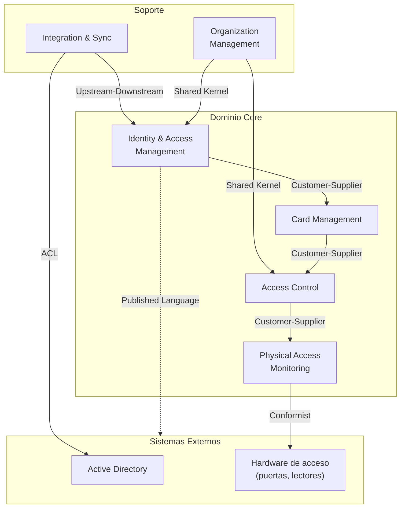

# SICA — Context Map (Mapa de Contextos Delimitados)

> **Fase Bolt**: DISCOVERY (Domain Modeling)
> **Fuente**: Análisis legacy + reglas de negocio extraídas
> **Arquitectura destino**: Cloud-native modular monolith

---

## Bounded Contexts identificados

| Contexto                        | Responsabilidad                                          | Core/Support |
| ------------------------------- | -------------------------------------------------------- | ------------ |
| **Identity & Access Management**| Gestión de usuarios, autenticación, autorización         | Core         |
| **Card Management**             | Gestión de tarjetas inteligentes, tipos, sincronización | Core         |
| **Access Control**              | Familias de acceso, permisos por terminal/circuito       | Core         |
| **Physical Access Monitoring**  | Eventos de entrada/salida, circuitos, alarmas            | Core         |
| **Organization Management**     | Multi-tenancy, organizaciones, segmentación              | Support      |
| **Integration & Sync**          | Sincronización con AD, servicios externos                | Support      |

---

## Context Map (relaciones entre contextos)

### Leyenda de relaciones

| Relación              | Descripción                                                      |
| --------------------- | ---------------------------------------------------------------- |
| **Upstream-Downstream** | Sync → IAM: Sync provee usuarios, IAM consume                  |
| **ACL** (Anticorruption Layer) | Sync ↔ AD: Traducción del modelo AD al modelo SICA    |
| **Shared Kernel**     | ORG ↔ IAM/ACCESS: comparten `OrganizationId`                     |
| **Customer-Supplier** | Relación cliente-proveedor con contrato definido                 |
| **Conformist**        | MONITOR → HW: nos adaptamos al protocolo del hardware            |
| **Published Language**| IAM expone API REST pública                                      |

---

## Detalle de contextos

### 1. Identity & Access Management (IAM)

**Responsabilidad**: Gestionar el ciclo de vida de usuarios (empleados y visitantes),
autenticación y autorización basada en terminal.

**Agregados**:
- `User` (Employee, Visitor)
- `Session`
- `Terminal`

**Reglas**:
- RULE-001: Validación de Employee ID
- RULE-002: Estrategia crear-o-actualizar
- RULE-003: Segmentación multi-tenant
- RULE-008: Autorización por terminal
- RULE-009: Extracción de principal Windows Auth

**Upstream dependencies**: `Integration & Sync` (usuarios de AD)

**Downstream consumers**: `Card Management`, `Access Control`

---

### 2. Card Management

**Responsabilidad**: Gestión del inventario de tarjetas inteligentes, clasificación por tipo,
asignación a usuarios, control de disponibilidad.

**Agregados**:
- `SmartCard`
- `VisitorCard`

**Reglas**:
- RULE-004: Clasificación por prefijo
- RULE-005: Sincronización de tarjetas
- RULE-006: Filtro de disponibilidad
- RULE-007: Ventana de validez

**Upstream dependencies**: `IAM` (identidad del propietario)

**Downstream consumers**: `Access Control`

---

### 3. Access Control

**Responsabilidad**: Gestión de permisos de acceso mediante familias (grupos),
asociación terminal↔familia↔circuito.

**Agregados**:
- `AccessFamily`
- `AccessPolicy`

**Reglas**:
- RULE-008: Autorización por terminal (familia asociada)

**Upstream dependencies**: `Card Management` (tarjetas), `IAM` (terminales)

**Downstream consumers**: `Physical Access Monitoring`

---

### 4. Physical Access Monitoring

**Responsabilidad**: Registro de eventos de entrada/salida, monitorización de circuitos
(puertas), alarmas, auditoría.

**Agregados**:
- `Circuit`
- `AccessEvent`
- `Alarm`

**Upstream dependencies**: `Access Control` (políticas de acceso)

**Downstream consumers**: Reporting externo (fuera del dominio)

---

### 5. Organization Management (Support)

**Responsabilidad**: Segmentación multi-tenant (REFER, REFERTelecom, etc.), políticas
por organización.

**Shared Kernel** con `IAM` y `Access Control`: el tipo `OrganizationId` se comparte.

**Reglas**:
- RULE-003: Segmentación por organización

---

### 6. Integration & Sync (Support)

**Responsabilidad**: Sincronización con Active Directory, wrapper de servicios externos,
adaptación de modelos externos (ACL).

**Upstream**: Active Directory

**Downstream**: `IAM` (provee usuarios sincronizados)

**Reglas**:
- RULE-001, RULE-002, RULE-003 (filtrado y merge de AD)

---

## Eventos de integración (entre contextos)

| Evento                       | Publicado por    | Consumido por           | Descripción                            |
| ---------------------------- | ---------------- | ----------------------- | -------------------------------------- |
| `UserSyncedFromAD`           | Integration      | IAM                     | Usuario sincronizado desde AD          |
| `UserCreated`                | IAM              | Card Management         | Nuevo usuario registrado               |
| `SmartCardActivated`         | Card Management  | Access Control          | Tarjeta activada y disponible          |
| `SmartCardAssigned`          | Card Management  | Access Control          | Tarjeta asignada a usuario/visitante   |
| `AccessPolicyChanged`        | Access Control   | Monitoring              | Cambio en política de acceso           |
| `AccessEventRecorded`        | Monitoring       | (externos)              | Entrada/salida registrada              |
| `TerminalAuthorized`         | IAM              | Access Control          | Terminal validado para sesión          |

---

## Decisiones de arquitectura (cross-cutting)

- **Patrón modular monolith**: cada bounded context es un módulo (carpeta) dentro del
  monolito .NET, pero con boundaries bien definidas (no referencias cruzadas directas).
- **Event-driven interno**: uso de eventos de dominio (in-process) para desacoplar módulos.
- **Shared Kernel mínimo**: solo `OrganizationId`, resto mediante eventos o DTOs de integración.
- **ACL obligatorio** para Active Directory: ningún modelo legacy se filtra al dominio.

---

## Handoff

| Artefacto         | Consumidor siguiente                                    |
| ----------------- | ------------------------------------------------------- |
| Este Context Map  | `@Bolt Architect` → C4 diagrams y ADRs                  |
| Bounded contexts  | Ficheros individuales en `docs/design/ddd/<context>/`   |
| Eventos           | `@Bolt Plan` → OpenAPI AsyncAPI + event contracts       |
