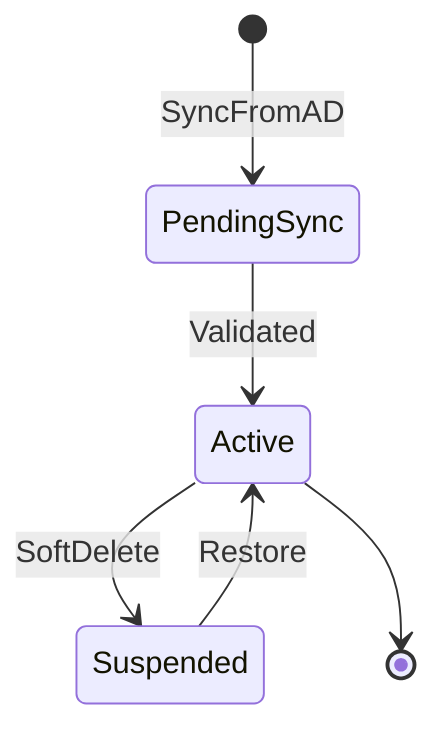
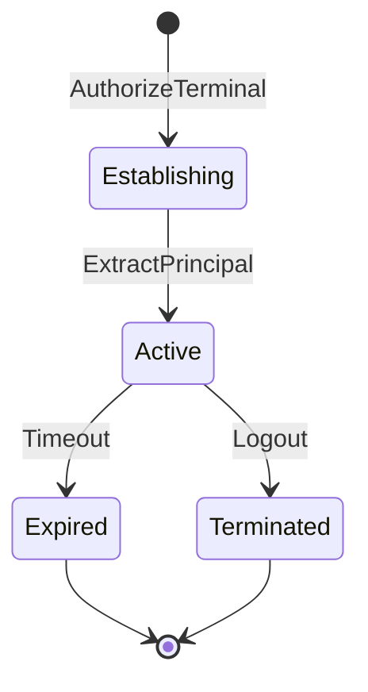
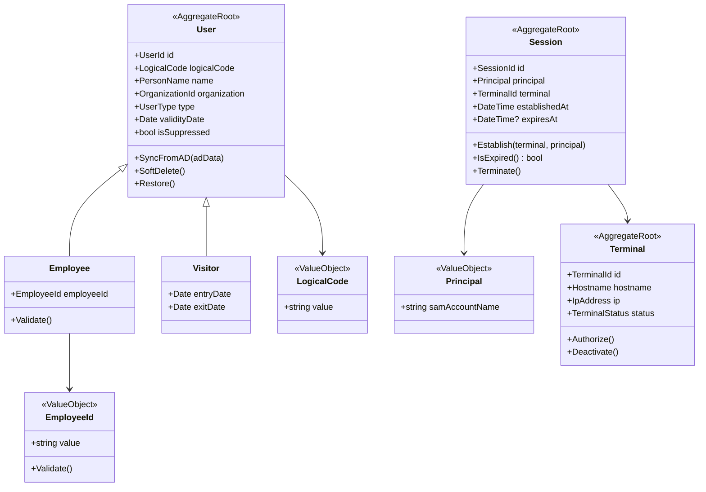

# Identity & Access Management — Modelo de Dominio

> **Bounded Context**: Identity & Access Management (IAM)
> **Fase**: DISCOVERY (Domain Modeling)

---

## Aggregates

### 1. User Aggregate

**Aggregate Root**: `User`

**Responsabilidad**: Mantener la consistencia del ciclo de vida de un usuario (empleado
o visitante), garantizar invariantes de identidad y pertenencia a organización.

**Invariantes**:
- `LogicalCode` único dentro de la organización.
- Si es `Employee`, `EmployeeId` debe ser válido (7 dígitos, no reservado).
- `Organization` es inmutable tras la creación.

**Entidades**:
- `User` (root) — identidad base
  - `Employee` (subtipo) — usuario sincronizado desde AD
  - `Visitor` (subtipo) — usuario temporal sin AD

**Value Objects**:
- `EmployeeId` — validación de 7 dígitos y prefijos reservados
- `LogicalCode` — código único en SICA
- `PersonName` — nombre + apellido
- `OrganizationId` — referencia a organización (shared kernel)

**Domain Events**:
- `UserCreated`
- `UserUpdated`
- `UserSyncedFromAD`
- `UserSoftDeleted`

**Ciclo de vida**:

---

### 2. Terminal Aggregate

**Aggregate Root**: `Terminal`

**Responsabilidad**: Garantizar que solo terminales registrados pueden acceder al sistema.

**Invariantes**:
- Hostname o IP únicos en el sistema.
- Estado `Active` para permitir autorización.

**Value Objects**:
- `Hostname` — nombre del terminal en mayúsculas
- `IpAddress` — dirección IP

**Domain Events**:
- `TerminalRegistered`
- `TerminalAuthorized`
- `TerminalDeactivated`

---

### 3. Session Aggregate

**Aggregate Root**: `Session`

**Responsabilidad**: Mantener el estado de una sesión autenticada, vinculando
un `Principal` a un `Terminal` autorizado.

**Invariantes**:
- `Terminal` debe estar registrado y activo.
- `Principal` no vacío.
- Sesión expira tras inactividad (timeout configurable).

**Value Objects**:
- `Principal` — nombre SAM extraído de Windows Auth
- `SessionId` — identificador único de sesión

**Domain Events**:
- `SessionEstablished`
- `SessionExpired`
- `SessionTerminated`

**Ciclo de vida**:

---

## Diagrama de clases (DDD)

---

## Reglas de negocio mapeadas

| Regla    | Aggregate afectado | Método/Invariante                           |
| -------- | ------------------ | ------------------------------------------- |
| RULE-001 | Employee           | `EmployeeId.Validate()`                     |
| RULE-002 | User               | `User.SyncFromAD()` — merge strategy        |
| RULE-003 | User               | `OrganizationId` (Shared Kernel)            |
| RULE-008 | Terminal, Session  | `Terminal.Authorize()`, `Session.Establish()`|
| RULE-009 | Session            | `Principal.ExtractFromWindowsAuth()`        |

---

## Handoff

- → [aggregates.md](aggregates.md): detalle de cada aggregate
- → [value-objects.md](value-objects.md): VOs con reglas de validación
- → [domain-events.md](domain-events.md): eventos y payloads
- → `@Bolt Plan`: data model → OpenAPI contracts
