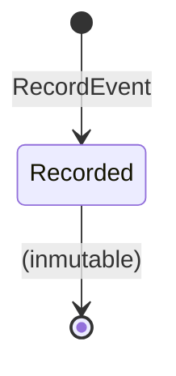
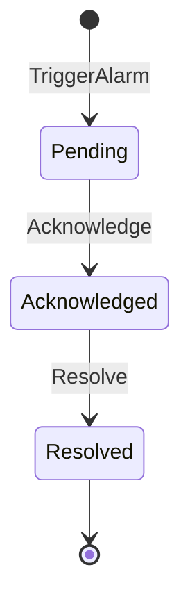
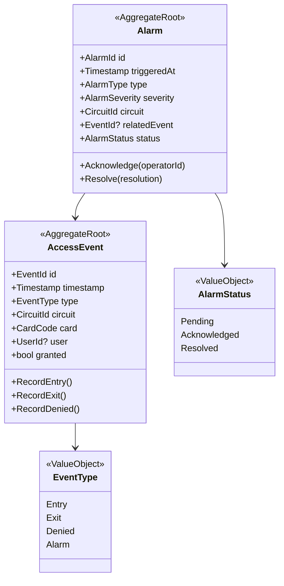

# Physical Access Monitoring — Modelo de Dominio

> **Bounded Context**: Physical Access Monitoring
> **Fase**: DISCOVERY (Domain Modeling)

---

## Aggregates

### 1. AccessEvent Aggregate

**Aggregate Root**: `AccessEvent`

**Responsabilidad**: Registrar de forma inmutable cada evento de entrada/salida en un
circuito, manteniendo trazabilidad completa para auditoría.

**Invariantes**:
- Un evento es inmutable tras su creación.
- `Timestamp` no puede ser futuro.
- `CircuitId` debe referenciar un circuito existente.
- `CardCode` debe referenciar una tarjeta existente.

**Value Objects**:
- `EventId` — identificador único
- `EventType` — Entrada / Salida / Denegado / Alarma
- `Timestamp` — fecha/hora del evento
- `CardCode` — código de tarjeta que generó el evento

**Domain Events**:
- `AccessEventRecorded`
- `AccessDenied`

**Ciclo de vida**:



---

### 2. Alarm Aggregate

**Aggregate Root**: `Alarm`

**Responsabilidad**: Gestionar alarmas de seguridad generadas por intentos de acceso
no autorizado, eventos anómalos o fallos de hardware.

**Invariantes**:
- Una alarma debe estar vinculada a un circuito o a un evento de acceso.
- Estado: `Pending`, `Acknowledged`, `Resolved`.

**Value Objects**:
- `AlarmSeverity` — Low, Medium, High, Critical
- `AlarmType` — UnauthorizedAccess, HardwareFailure, TamperAttempt

**Domain Events**:
- `AlarmTriggered`
- `AlarmAcknowledged`
- `AlarmResolved`

**Máquina de estados**:



---

## Diagrama de clases (DDD)



---

## Reglas de negocio mapeadas

| Regla    | Aggregate afectado | Método/Invariante                           |
| -------- | ------------------ | ------------------------------------------- |
| (ninguna regla formal extraída — UC-005 registra eventos de circuito) | AccessEvent | `RecordEntry()`, `RecordExit()` |

---

## Relaciones con otros contextos

| Contexto upstream     | Relación                                    |
| --------------------- | ------------------------------------------- |
| Access Control        | Consume políticas para determinar `granted` |
| Card Management       | `CardCode` referencia a `SmartCard`         |

| Contexto downstream   | Relación                                    |
| --------------------- | ------------------------------------------- |
| Reporting externo     | Consume `AccessEvent` para informes         |

---

## Domain Services

### EventRecorderService

**Responsabilidad**: Coordinar la creación de un `AccessEvent`, evaluar permisos y
disparar alarmas si es necesario.

**Operación principal**:

```csharp
AccessEvent RecordAccess(CardCode card, CircuitId circuit, EventType type)
{
    // 1. Evaluar permiso con Access Control
    var granted = _permissionService.CanAccess(card.OwnerId, circuit);
    
    // 2. Crear evento
    var evt = AccessEvent.Record(card, circuit, type, granted);
    
    // 3. Si denegado, disparar alarma
    if (!granted) {
        _alarmService.TriggerAlarm(AlarmType.UnauthorizedAccess, circuit, evt.Id);
    }
    
    return evt;
}
```

---

## Lenguaje Ubicuo

| Término             | Definición                                                           |
| ------------------- | -------------------------------------------------------------------- |
| **Access Event**    | Registro inmutable de entrada/salida en un circuito                   |
| **Entry**           | Evento de paso de tarjeta en entrada                                  |
| **Exit**            | Evento de paso de tarjeta en salida                                   |
| **Denied**          | Intento de acceso rechazado por falta de permiso                      |
| **Alarm**           | Alerta de seguridad generada por evento anómalo                       |
| **Acknowledge**     | Operador toma conocimiento de la alarma                               |
| **Resolve**         | Alarma cerrada tras investigación                                     |

---

## Handoff

- → [aggregates.md](aggregates.md): detalle de AccessEvent y Alarm
- → [domain-services.md](domain-services.md): EventRecorderService
- → [domain-events.md](domain-events.md): AccessEventRecorded, AlarmTriggered
- → `@Bolt Plan`: contracts para API de eventos y alarmas
