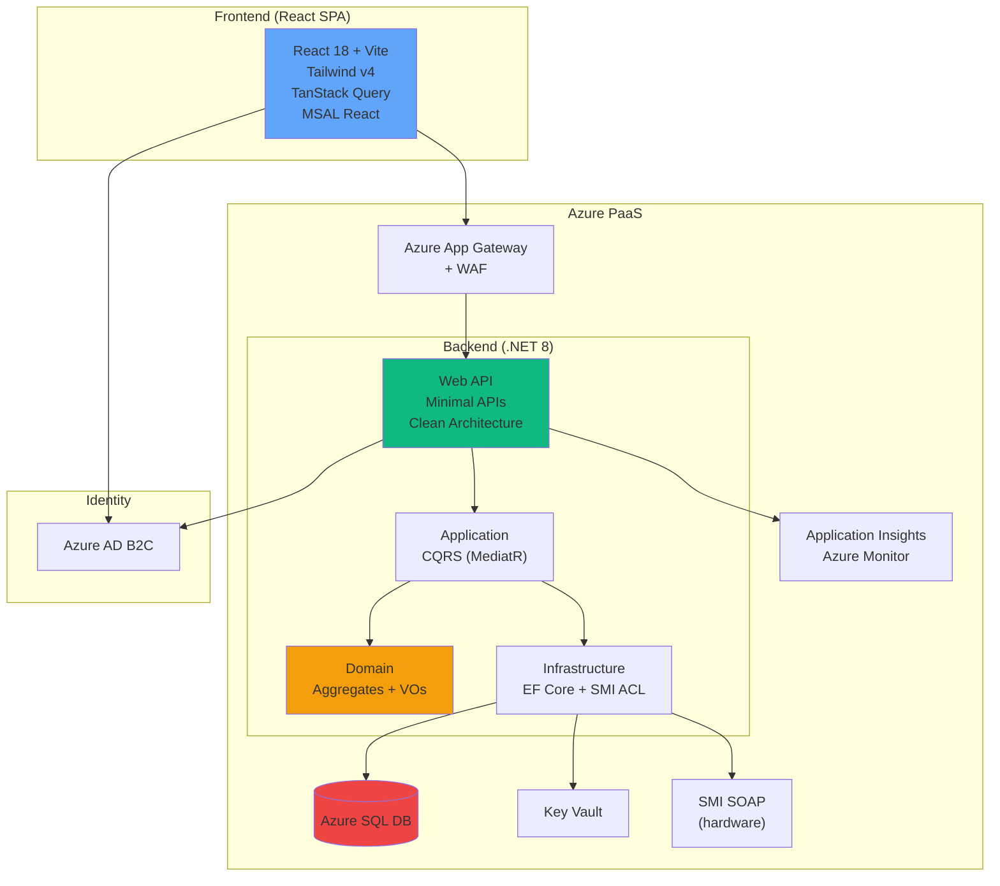
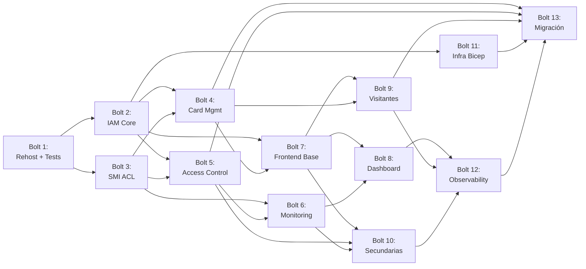

# Plan de implementación — Migración SICAWeb

> **Feature**: 001-migracion-sica
> **Fase Bolt**: PLAN (Technical Planning)
> **Fecha**: 2026-06-24
> **Estimación**: 13 Bolts (~6,5 semanas, equipo 2 personas)

---

## 1. Resumen ejecutivo

Este plan transforma el legacy ASP.NET WebForms en una arquitectura cloud-native Azure
mediante el patrón **Strangler Fig** en 4 fases:

1. **Rehost** — Legacy a Azure App Service
2. **API** — Web API .NET 8 con Clean Architecture + CQRS
3. **SPA** — React 18 + Tailwind CSS
4. **Decomisión** — Apagado del legacy

**Bounded Contexts** (4 core):
- **IAM** (Identity & Access Management)
- **Card Management** (gestión tarjetas inteligentes)
- **Access Control** (familias, políticas, circuitos)
- **Monitoring** (eventos de acceso, zonas)

**Artefactos clave**:
- 📄 [research.md](research.md) — Decisiones arquitectónicas
- 🗄️ [data-model.md](../requirements/data-model.md) — Modelo de datos EF Core
- 🔌 [openapi.yaml](../contracts/openapi.yaml) — Contrato API REST (contract-first)

---

## 2. Arquitectura objetivo



---

## 3. Estrategia Strangler Fig

| Fase | Duración | Hitos |
|---|---|---|
| **Fase 1: Rehost** | 0,5 sem (Bolt 1) | Legacy en Azure, tests caracterización, baseline CI/CD |
| **Fase 2: API** | 2,5 sem (Bolts 2-6) | Web API .NET 8 con 4 bounded contexts + SMI ACL |
| **Fase 3: SPA** | 2 sem (Bolts 7-10) | React SPA reproduce páginas legacy críticas |
| **Fase 4: Decomisión** | 1,5 sem (Bolts 11-13) | Infra productiva, monitorización, apagado legacy |

**Coexistencia**: Fases 2-3 (4-5 semanas) — legacy y nueva API comparten la misma BD.

---

## 4. Desglose en módulos

### 4.1 Módulo: Plataforma base (Bolt 1)

**Objetivo**: Rehost del legacy + tests de caracterización + baseline CI/CD

**Componentes**:
- Azure App Service para legacy WebForms
- GitHub Actions con quality gates (linting, coverage, mutation)
- Tests de caracterización (ApprovalTests.Net) para 5 reglas P0

**Complejidad**: Baja (infraestructura estándar)
**Riesgo**: Bajo

---

### 4.2 Módulo: Backend — IAM (Bolts 2-3)

**Bounded Context**: Identity & Access Management

**Aggregates**:
- `User` (Employee, Visitor)
- `Terminal`
- `Session` (sin persistencia — tokens Azure AD B2C)

**Endpoints OpenAPI**:
- `POST /api/v1/iam/terminals/authorize` → RULE-001
- `GET|POST|PUT|DELETE /api/v1/iam/terminals`
- `GET|POST /api/v1/iam/users`

**Complejidad**: Media (3 aggregates, RULE-002 Windows Auth → Azure AD)
**Riesgo**: Medio (mapeo Session legacy → tokens B2C requiere validación)

---

### 4.3 Módulo: Backend — Card Management (Bolt 4)

**Bounded Context**: Card Management

**Aggregates**:
- `SmartCard` (clasificación por prefijo)
- `VisitorCard` (disponibilidad según RULE-008)

**Endpoints OpenAPI**:
- `GET|POST /api/v1/cards`
- `GET /api/v1/cards/visitors/available` → RULE-008
- `POST /api/v1/cards/visitors/assign` → RULE-009
- `POST /api/v1/cards/visitors/assignments/{id}/exit`

**Complejidad**: Alta (sincronización SMI, clasificación tipo, disponibilidad compleja)
**Riesgo**: Alto (dependencia SMI sin mock aún)

---

### 4.4 Módulo: Backend — SMI Anti-Corruption Layer (Bolt 3)

**Objetivo**: Desacoplar dominio del SOAP client SMI

**Interfaz**:
```csharp
public interface ISMIService
{
    Task<SmartCardProperties> GetCardByIdAsync(CardId id);
    Task<IEnumerable<AccessEvent>> GetLastEventsAsync(CircuitId circuitId, int hours, int maxEvents);
    Task UpdateCardStatusAsync(CardId id, CardStatus status);
    Task<IEnumerable<Family>> GetFamiliesAsync();
    Task<IEnumerable<Circuit>> GetCircuitsAsync();
}
```

**Implementaciones**:
- `SMISoapAdapter` — producción (SOAP WCF)
- `SMIMockAdapter` — tests (respuestas predefinidas del legacy capturadas)

**Complejidad**: Alta (reverse engineering del WSDL sin spec formal)
**Riesgo**: Alto (SPOF crítico, sin documentación)

---

### 4.5 Módulo: Backend — Access Control (Bolt 5)

**Bounded Context**: Access Control

**Aggregates**:
- `AccessFamily` (grupos de acceso)
- `AccessPolicy` (política triple Terminal ↔ Familia ↔ Circuito)
- `Circuit` (puntos de acceso físicos)

**Endpoints OpenAPI**:
- `GET|POST /api/v1/access-control/families`
- `POST /api/v1/access-control/families/{id}/members` → añadir/quitar usuarios
- `GET /api/v1/access-control/circuits`
- `GET|PUT /api/v1/access-control/policies/terminal/{id}` → RULE-007

**Complejidad**: Alta (modelo de permisos complejo, transacción RULE-007)
**Riesgo**: Medio (lógica de permisos crítica pero bien documentada)

---

### 4.6 Módulo: Backend — Monitoring (Bolt 6)

**Bounded Context**: Physical Access Monitoring

**Aggregates**:
- `AccessEvent` (inmutable, consulta desde SMI)
- `Alarm` (futuro, no MVP)

**Endpoints OpenAPI**:
- `GET /api/v1/monitoring/events` → RULE-010, RULE-011
- `GET /api/v1/monitoring/zones` → conteo por zona
- `GET /api/v1/monitoring/zones/{id}/users`

**Complejidad**: Media (mayormente consulta, lógica RULE-011 clara)
**Riesgo**: Bajo

---

### 4.7 Módulo: Frontend — Foundation (Bolt 7)

**Objetivo**: Setup React + componentes base + autenticación

**Componentes**:
- Vite + TypeScript config
- Tailwind CSS v4 design system base (colores, tipografía, spacing)
- MSAL React configurado con Azure AD B2C
- Layouts: `DashboardLayout`, `AuthLayout`
- Componentes base: `Button`, `Input`, `Card`, `Table`, `Modal`
- TanStack Query configurado (API clients)

**Páginas**:
- `/login` (redirect Azure AD B2C)
- `/dashboard` (home)

**Complejidad**: Media (setup inicial voluminoso pero estándar)
**Riesgo**: Bajo

---

### 4.8 Módulo: Frontend — Páginas críticas (Bolts 8-9)

**Bolt 8**: PagPrincipal (Dashboard monitorización)

**Componentes**:
- `CircuitSelector` — dropdown circuitos
- `EventLog` — tabla eventos recientes (polling cada 5s)
- `UserDetail` — foto + datos empleado de último evento

**Endpoints consumidos**:
- `GET /api/v1/access-control/circuits`
- `GET /api/v1/monitoring/events?circuitId={id}`

**Bolt 9**: PagVisitantes (Gestión visitantes)

**Componentes**:
- `VisitorCardList` — tarjetas asignadas activas (polling cada 15s)
- `VisitorCardAssignmentForm` — formulario activación
- `AvailableCardsList` — tarjetas disponibles

**Endpoints consumidos**:
- `GET /api/v1/cards/visitors/available?terminalId={id}`
- `POST /api/v1/cards/visitors/assign`
- `POST /api/v1/cards/visitors/assignments/{id}/exit`
- `GET /api/v1/cards/visitors/assignments?terminalId={id}&active=true`

**Complejidad**: Alta (polling, validación RULE-009, estado complejo)
**Riesgo**: Medio (UX debe reproducir flujo legacy sin perder usabilidad)

---

### 4.9 Módulo: Frontend — Páginas secundarias (Bolt 10)

**PagZonas** (Monitorización zonas):
- `ZoneSummary` — tabla zonas con conteo (polling cada 60s)
- `ZoneDetail` — lista personas en zona seleccionada

**PagConfigAcessos** (Configuración accesos — restringida):
- `TerminalSelector`
- `AccessPolicyEditor` — selección múltiple familias/circuitos
- Guarda perfil completo (DELETE + INSERT transaccional)

**PagHistorico** (Consulta histórica):
- `CircuitMultiSelector`
- `DateRangePicker`
- `HistoricalEventsTable` → lógica RULE-011, RULE-012

**Complejidad**: Media (lógica clara, baja interactividad excepto ConfigAcessos)
**Riesgo**: Bajo

---

### 4.10 Módulo: Infraestructura Azure (Bolt 11)

**Objetivo**: Bicep IaC + despliegue automático

**Recursos**:
- **Resource Group** (dev, uat, pre, prod)
- **Azure SQL Database** (tier: S1 en prod, Basic en dev/uat)
- **Azure App Service Plan** (P1v3 en prod, B1 en dev/uat)
- **Azure App Service** × 2 (Web API + SPA)
- **Azure Application Gateway** + WAF (sólo prod)
- **Azure Key Vault** (secretos + connection strings)
- **Azure Monitor** + Application Insights

**Bicep modules**:
```
infra/bicep/
├── main.bicep                 # Orquestador
├── modules/
│   ├── sql-database.bicep
│   ├── app-service.bicep
│   ├── key-vault.bicep
│   ├── app-gateway.bicep
│   └── monitoring.bicep
└── parameters/
    ├── dev.parameters.json
    ├── uat.parameters.json
    └── prod.parameters.json
```

**GitHub Actions workflow**:
- Trigger: manual (prod), auto (dev/uat)
- Stages: validate → what-if → deploy → smoke-tests

**Complejidad**: Baja (Bicep estándar Azure PaaS)
**Riesgo**: Bajo

---

### 4.11 Módulo: Observabilidad (Bolt 12)

**Objetivo**: Monitorización, alertas, dashboards

**Application Insights**:
- Auto-instrumentation .NET 8 (OpenTelemetry SDK)
- Custom metrics: `sica_terminal_authorizations`, `sica_card_assignments`, `sica_smi_calls_duration`
- Distributed tracing: API → EF Core → SMI

**Azure Monitor Alerts**:
| Alert | Threshold | Severidad |
|---|---|---|
| API 5xx errors | > 5 en 5 min | Sev-2 |
| DB DTU > 80% | > 80% durante 10 min | Sev-3 |
| SMI timeout | > 3 timeouts consecutivos | Sev-2 |
| SPA error rate | > 10% durante 5 min | Sev-3 |

**Grafana Dashboards** (opcional):
- Panorama general (RPS, latencia p95, errores)
- Bounded Context drill-down (IAM, Cards, Access Control, Monitoring)

**Complejidad**: Media (dashboards + alertas customizadas)
**Riesgo**: Bajo

---

### 4.12 Módulo: Migración de datos + Decomisión legacy (Bolt 13)

**Fase 1: Migración incremental**

| Tabla legacy | Tabla nueva | Script |
|---|---|---|
| `tblTerminais` | `sica.Terminals` | Migración directa |
| `tblCartoes` | `sica.SmartCards` | + clasificación `CardType` por prefijo |
| `tblFamilias` | `sica.AccessFamilies` | Migración directa |
| `tblCircuitos` | `sica.Circuits` | + resolver jerarquía `CircuitGroupId` |
| `tblAD_AD_SQL` | `sica.Users` (Employee) | Importar employeeId → LogicalCode |
| `tblVisitantes` | `sica.Users` (Visitor) + `sica.VisitorCardAssignments` | Últimos 90 días |
| `tbl*Terminal` | `sica.TerminalAccessPolicies` + `sica.TerminalPolicyRules` | Reconstruir triple (Terminal ↔ Familia ↔ Circuito) |

**Fase 2: Vistas de compatibilidad**

Crear vistas `dbo.vw*` (6 vistas) para que legacy pueda leer datos de tablas nuevas en modo read-only.

**Fase 3: Decomisión**

1. Validar tráfico 100% en nueva API durante 2 semanas.
2. Apagar legacy App Service.
3. Drop tablas legacy (`tbl*`, `vw*` originales) tras backup final.
4. Retener backups 90 días.

**Complejidad**: Alta (scripts de migración complejos, validación intensiva)
**Riesgo**: Medio (data loss si scripts fallan — mitigado con dry-run)

---

## 5. Resumen de Bolts

| # | Nombre | Módulo | Duración | Complejidad | User Stories |
|---|---|---|---|---|---|
| **1** | **Rehost + Characterization** | Plataforma base | 3 días | Baja | US-1 |
| **2** | **Backend: IAM Core** | IAM | 2 días | Media | US-2 (parcial) |
| **3** | **Backend: SMI ACL** | SMI Adapter | 3 días | Alta | US-2 (infra) |
| **4** | **Backend: Card Management** | Cards | 3 días | Alta | US-2 (parcial) |
| **5** | **Backend: Access Control** | Access Control | 3 días | Alta | US-2 (parcial) |
| **6** | **Backend: Monitoring** | Monitoring | 2 días | Media | US-2 (parcial) |
| **7** | **Frontend: Foundation** | React base | 2 días | Media | US-3 (setup) |
| **8** | **Frontend: Dashboard** | PagPrincipal | 3 días | Alta | US-3 (parcial) |
| **9** | **Frontend: Visitantes** | PagVisitantes | 3 días | Alta | US-3 (parcial) |
| **10** | **Frontend: Secundarias** | Zonas, Config, Histórico | 2 días | Media | US-3 (parcial) |
| **11** | **Infra: Azure Bicep** | IaC | 2 días | Baja | US-5 (parcial) |
| **12** | **Observability** | Monitoring | 2 días | Media | US-5 (parcial) |
| **13** | **Data Migration + Decomisión** | Migración | 3 días | Alta | US-1, US-2, US-3 |

**Total**: 13 Bolts × ~2,4 días promedio = **~31 días** (6,2 semanas calendario con equipo 2 personas)

---

## 6. Dependencias entre Bolts



**Camino crítico**: B1 → B3 → B4 → B7 → B9 → B13 (6 Bolts secuenciales, resto paralelizable)

---

## 7. Quality gates por Bolt

Todos los Bolts deben pasar estos gates antes de merge a `develop`:

| Gate | Threshold | Herramienta |
|---|---|---|
| **Linting** | 0 warnings | Roslyn (backend), ESLint (frontend) |
| **Unit tests** | ≥ 80% coverage | Coverlet / Vitest |
| **Mutation tests** | ≥ 70% score | Stryker.NET / Stryker4s |
| **Architecture tests** | 0 violations | NetArchTest |
| **Security scan** | 0 Critical/High | Trivy |
| **BDD scenarios** (@smoke) | 100% passing | Reqnroll / Playwright |

---

## 8. Riesgos y mitigaciones

| Riesgo | Probabilidad | Impacto | Mitigación |
|---|---|---|---|
| **SMI sin mock** | Alta | Alto | Bolt 3 priorizado, capturar respuestas reales del legacy |
| **RULE-007 sin transacción en legacy** | Media | Medio | Tests de caracterización detectan inconsistencia, nueva API usa transacción EF |
| **Periodo coexistencia largo** | Media | Medio | Limitar a 4-5 semanas, freeze de cambios en legacy durante migración |
| **BD Alizes/REFER externa** | Baja | Medio | Connection string secundaria read-only, sin cambios en REFER durante migración |
| **Azure AD B2C mapeo Session** | Media | Alto | Validación intensiva en Bolt 2 con characterization tests |

---

## 9. Entregables

| Entregable | Descripción |
|---|---|
| `.boltf/analysis/SICAWeb/` | Análisis legacy (ASSESSMENT, TOPOLOGY, BUSINESS_RULES, DATA_OBJECTS) |
| `specs/001-migracion-sica/` | Feature spec + planning + contracts |
| `src/SICA.Api/` | Web API .NET 8 (Minimal APIs + Clean Architecture) |
| `src/SICA.Application/` | CQRS handlers (MediatR) |
| `src/SICA.Domain/` | Aggregates, VOs, domain events |
| `src/SICA.Infrastructure/` | EF Core, SMI ACL, repos |
| `frontend/` | React 18 SPA (Vite + TypeScript + Tailwind) |
| `infra/bicep/` | Bicep IaC modules |
| `.github/workflows/` | CI/CD pipelines (build, test, deploy) |
| `tests/` | Tests de caracterización + BDD (Reqnroll + Playwright) |

---

## 10. Siguiente paso

**Ejecutar**: `@Bolt Tasks` para generar `planning/tasks.md` con el desglose detallado de cada Bolt en tareas ejecutables.

**Post-tasks**: `@Bolt Implement` para comenzar la implementación de Bolt 1 (Rehost + Characterization tests).
